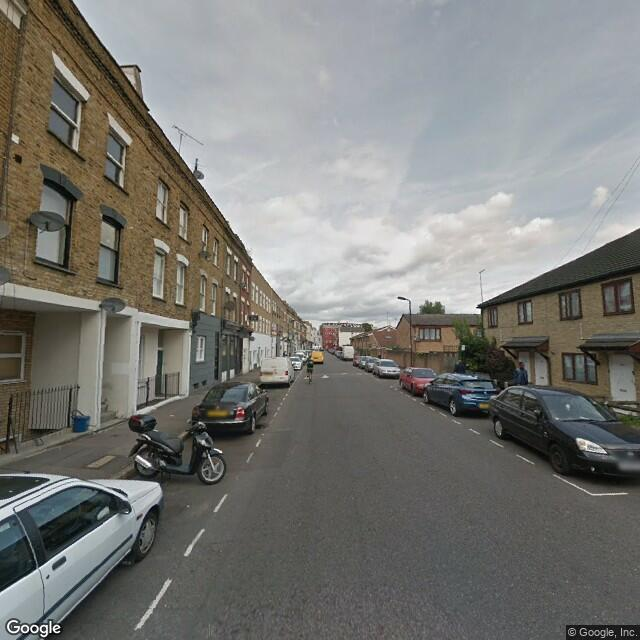
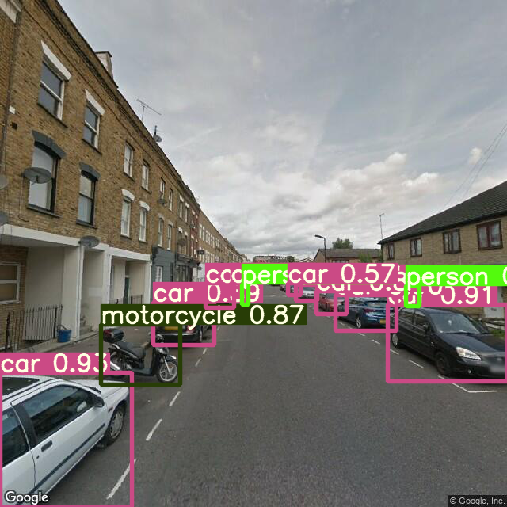
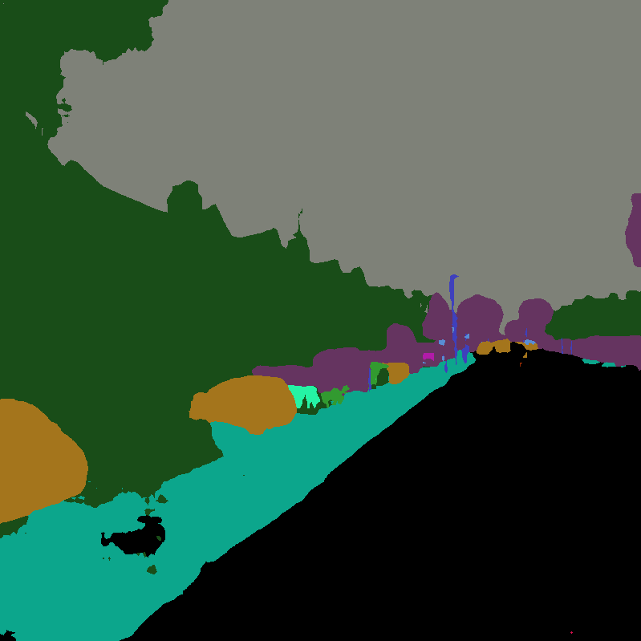
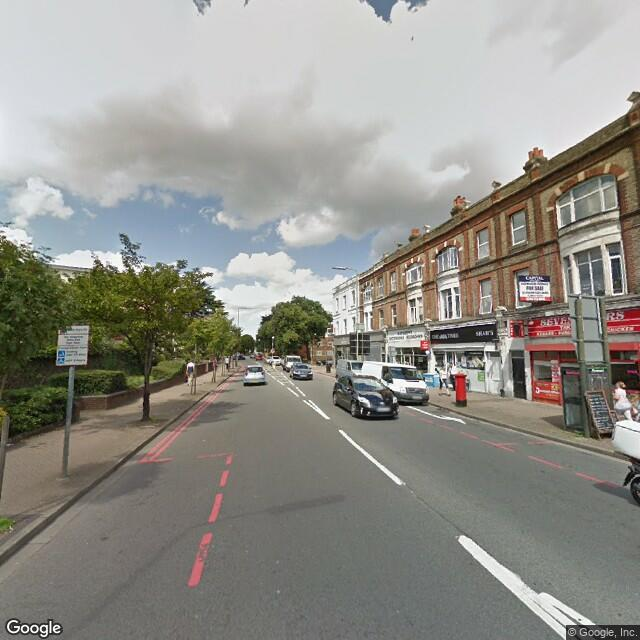
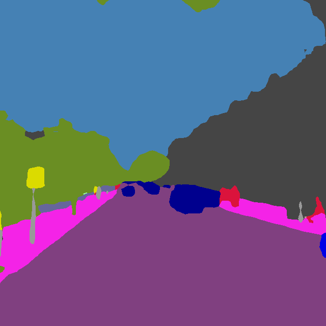

# Road Safety for Cyclists in London
[Jupyter Notebook](https://github.com/warcraft12321/RoadSafety/blob/master/RoadSafety.ipynb) | [Report](https://github.com/warcraft12321/RoadSafety/blob/master/text/report.pdf) | [Presentation](https://github.com/warcraft12321/RoadSafety/blob/master/text/presentation.pdf)

### Aim

The aim of this project was to use imagery to estimate safety on the roads of London, from a cyclist’s perspective. After
a brief introduction to the most important road safety indicators, a ranked list with several risk factors was compiled.
Risk factors were obtained from Google StreetView imagery dataset using the object detection YOLOv5 (released on the ___ by ___) and
image segmentation PSPNet101 (released on the ___ by ___).

Imagery dataset contains 512 000 images of greater London, distributed across 1400 boroughs. Each image is labeled in accordance
to the LSOA it belongs. Images are organized in sets of 4 which corresponds to 4 90º angles from a total of 125 000 points.

Both YOLOv5 and PSPNet101 were benchmarked and validated using a set of 1 image per LSOA from the dataset.

Data was storage and processed in the secure High Performance Cluster from Imperial College London.

### Object Detection
YOLOv5 is the most recent version of YOLO which was originally developed by Joseph Redmon. First version runs in framework
called Darknet which was built specifically to execute YOLO.

Version 5 is only the 2nd model which was not developed by Joseph Redmon (after version 4) and the first running in the
state-of-the-art machine learning framework PyTorch.

This model was pre-trained using Coco dataset. Thus, it was able to identify 30 different classes of objects. Distributed
over 6 categories ().

--------------------------- Image Examples ---------------------------

Original Image            |  YOLOv5
:-------------------------:|:-------------------------:
  |  

[(Click to See 1 Image per LSOA)](https://drive.google.com/drive/folders/1G-EdZtO3bqRzG-OqnumDWjP08yihJ05q?usp=sharing)

--------------------------- Stats ---------------------------

[YOLOv5](https://github.com/ultralytics/yolov5)

### Image Segmentation

Image segmentation models reached a precision plateau (in terms of average IoU) in the previous 2 years. Due to their
long execution times, it was chosen the model executing faster and with the higher precision.

PSPNet101 was pre-trained in Cityscapes dataset. This way, it was able to label all pixels from an image across 100
categories.

--------------------------- Image Examples ---------------------------

Original Image            |  PSPNet101
:-------------------------:|:-------------------------:
  |  

[Click to See 1 Image per LSOA](https://drive.google.com/drive/folders/1fel8ew7h2eNJRMkXpv9lF4Zl1pydo4h-?usp=sharing)

--------------------------- Stats ---------------------------

[PSPNet101](https://github.com/hellochick/PSPNet-tensorflow)

### Results

### Supervisors
[Majid Ezzati](https://www.imperial.ac.uk/people/majid.ezzati) (Imperial College London) | [Ricky Nathvani](https://www.imperial.ac.uk/people/r.nathvani) (Imperial College London)

Featured in Towards Data Science (Medium) -> [Article](https://towardsdatascience.com/imperial-college-london-1c9bb442926)

Roadmap -> [Wiki](https://github.com/warcraft12321/RoadSafety/wiki)