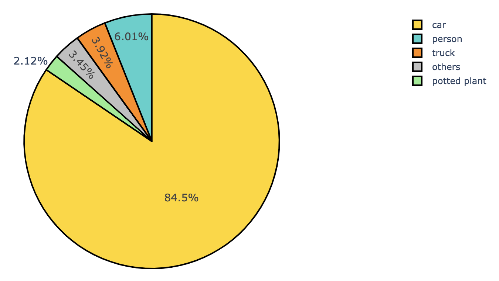
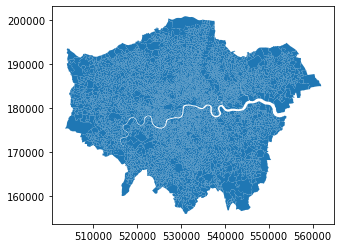

# Road Safety for Cyclists in London
[Jupyter Notebook](https://github.com/warcraft12321/RoadSafety/blob/master/RoadSafety.ipynb) | [Report](https://github.com/warcraft12321/RoadSafety/blob/master/text/report.pdf) | [Presentation](https://github.com/warcraft12321/RoadSafety/blob/master/text/presentation.pdf)

### Aim

The aim of this project was to use imagery to estimate safety on the roads of London, from a cyclist’s perspective. After
a brief introduction to the most important road safety indicators, a ranked list with several risk factors was compiled.
Risk factors were obtained from Google StreetView (GSV) imagery dataset using the object detection YOLOv5 (released in June 2020 by Glenn Jocher) and
image segmentation PSPNet101 (Pyramid Scene Parsing Network) (released in July 2017 by Hengshuang Zhao et al.).

Imagery dataset contains 518 350 images of greater London, distributed across 4833 boroughs. Each image is labeled in accordance
to the LSOA it belongs. Images are organized in sets of 4 which corresponds to 4 90º angles from a total of 129 588 points.

Both YOLOv5 and PSPNet101 were benchmarked and validated using a set of 1 image per LSOA from the dataset.

Data was storaged and processed in the secure High Performance Cluster from Imperial College London.

### Object Detection

YOLOv5 is the most recent version of YOLO which was originally developed by Joseph Redmon. First version runs in framework
called Darknet which was purposely built to execute YOLO.

Version 5 is the 2nd model which was not developed by Joseph Redmon (after version 4) and the first running in the
state-of-the-art machine learning framework PyTorch.

This model was pre-trained using Coco dataset. Thus, it is able to identify 80 object categories. Distributed
over 11 categories.

  
COCO Categories

Person | Vehicle | Outdoor | Animal | Accessory | Sports | Kitchen | Food | Furniture | Electronic | Appliance | Indoor
:-------------------------:|:-------------------------:|:-------------------------:|:-------------------------:|:-------------------------:|:-------------------------:|:-------------------------:|:-------------------------:|:-------------------------:|:-------------------------:|:-------------------------:|:-------------------------:
Person | Bicycle | Traffic Light | Bird | Backpack | Frisbee | Bottle | Car | Chair | Tv | Microwave | Book
 | Car | Fire Hydrant | Cat | Umbrella | Skis | Wine Glass | Truck | Couch | Laptop | Oven | Clock
 | Motorcycle | Stop Sign | Dog | Handbag | Snowboard | Cup | Bus | Potted Plant | Mouse | Toaster | Vase
 | Airplane | Parking Meter | Horse | Tie | Sports Ball | Fork | Caravan | Bed | Remote | Sink | Scissors
 | Bus | Bench | Sheep | Suitcase | Kite | Knife | Trailer | Dinning Table | Keyboard | Refrigerator | Teddy Bear
 | Train |  | Cow |  | Baseball Bat | Spoon | Train | Toilet | Cell Phone | | Hair Drier
 | Truck |  | Elephant |  | Baseball Glove | Bowl | Motorcycle | | | | Toothbrush
 | Boat |  | Bear |  | Skateboard | Banana | Bicycle | | | |
 |  |  | Zebra |  | Surfboard | Apple | License Plate | | | |
 |  |  | Giraffe |  | Tennis Racket | Sandwich | License Plate | | | |
 |  |  |  |  | Tennis Racket | Orange | | | | |
 |  |  |  |  |  | Broccoli | | | | |
 |  |  |  |  |  | Carrot | | | | |
 |  |  |  |  |  | Hot dog | | | | |
 |  |  |  |  |  | Pizza | | | | |
 |  |  |  |  |  | Donut | | | | |
 |  |  |  |  |  | Cake | | | | |

Original            |  YOLOv5
:-------------------------:|:-------------------------:
  |  

[(Click to See 1 Image per LSOA)](https://drive.google.com/drive/folders/1G-EdZtO3bqRzG-OqnumDWjP08yihJ05q?usp=sharing)

#### Stats

Object            |  Number Occurrences | Object            |  Number Occurrences | Object            |  Number Occurrences
:-------------------------:|:-------------------------:|:-------------------------:|:-------------------------:|:-------------------------:|:-------------------------:
Car  |  1509344 | Bicycle  |  10894 | Chair  |  2191
Person  |  107266 | Motorcycle  |  8970 | Handbag  |  2090
Truck  |  70083 | Traffic Light  |  6310 | Backpack  |  1939
Potted Plant  |  37917 | Bench  |  5013 | Stop Sign  |  1282
Bus  |  11512 | Clock  |  2750 | Fire Hydrant  |  1168

#### Files

File            |  Description
:-------------------------:|:-------------------------:
[total_stats.json](https://github.com/warcraft12321/RoadSafety/blob/master/yolov5/total_stats.json) |  Number of objects detected by YOLOv5 in GSV imagery by class
[lsoa_objects_number.json](https://github.com/warcraft12321/RoadSafety/blob/master/yolov5/lsoa_objects_number.json) |  Number of objects detected by YOLOv5 in GSV imagery by class and LSOA

[YOLOv5](https://github.com/ultralytics/yolov5)

### Image Segmentation

Image segmentation models reached a precision plateau (in terms of average IoU) in the previous 2 years. Due to their
long execution times, it was chosen the model executing faster and with the higher precision.

PSPNet101 was pre-trained in Cityscapes dataset. This way, it was able to label all pixels from an image across 100
categories.

  
Cityscapes Categories

Void | Flat | Construction | Object | Nature | Sky | Human | Vehicle
:-------------------------:|:-------------------------:|:-------------------------:|:-------------------------:|:-------------------------:|:-------------------------:|:-------------------------:|:-------------------------:
Unlabeled | Road | Building | Pole | Vegetation | Sky | Person | Car
Ego Vehicle | Sidewalk | Wall | Polegroup | Terrain |  | Rider | Truck
Rectification Border | Parking | Fence | Traffic Light |  |  |  | Bus
Out of ROI | Road | Guard Rail | Traffic Sign |  |  |  | Caravan
Static |  | Bridge |  |  |  |  | Trailer
Dynamic |  | Tunnel |  |  |  |  | Train
Ground |  |  |  |  |  |  | Motorcycle
Ground |  |  |  |  |  |  | Bicycle
Ground |  |  |  |  |  |  | License Plate

Original            |  PSPNet101
:-------------------------:|:-------------------------:
  |  

[(Click to See 1 Image per LSOA)](https://drive.google.com/drive/folders/1fel8ew7h2eNJRMkXpv9lF4Zl1pydo4h-?usp=sharing)

#### Stats

#### Files

File            |  Description
:-------------------------:|:-------------------------:
[total_stats.json](https://github.com/warcraft12321/RoadSafety/blob/master/pspnet101/total_stats.json) |  Total Number of Pixels per Cityscapes Label in GSV Dataset
[rgb_label.json](https://github.com/warcraft12321/RoadSafety/blob/master/pspnet101/rgb_label) |  Conversion from RGB values to a Cityscapes label

[PSPNet101](https://github.com/hellochick/PSPNet-tensorflow)

### Supervisors
[Majid Ezzati](https://www.imperial.ac.uk/people/majid.ezzati) (Imperial College London) | [Ricky Nathvani](https://www.imperial.ac.uk/people/r.nathvani) (Imperial College London)

Featured in Towards Data Science (Medium) -> [Article](https://towardsdatascience.com/imperial-college-london-1c9bb442926)

Roadmap -> [Wiki](https://github.com/warcraft12321/RoadSafety/wiki)